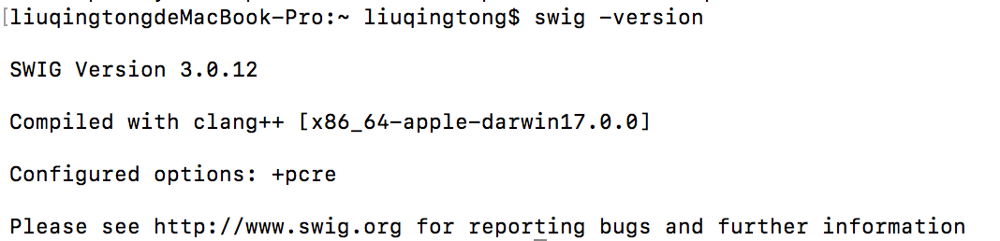

# swig 把c/c++ 封装成python可调用的so文动态链接库


注意：使用此种方法产生的so文件放在 python的site 目录下，可以直接import example，调用模块。

我们经常会看到python一些项目源码中，有的方法直接pass

如

```text
 def has_key(self, k): # real signature unknown; restored from __doc__
        """ D.has_key(k) -> True if D has a key k, else False """
        return False
 
    def items(self): # real signature unknown; restored from __doc__
        """ D.items() -> list of D's (key, value) pairs, as 2-tuples """
        return []
 
    def iteritems(self): # real signature unknown; restored from __doc__
        """ D.iteritems() -> an iterator over the (key, value) items of D """
        pass

```

`但是，他们确实执行了，什么原因呢，就是使用了swig制作的so文件。`

`C` 和 `C++` 被公认为（理当如此）创建高性能代码的首选平台。对开发人员的一个常见要求是向脚本语言接口公开 `C/C++` 代码，这正是 Simplified Wrapper and Interface Generator \(SWIG\) 的用武之地。SWIG 允许您向广泛的脚本语言公开 `C/C++` 代码，包括 Ruby、Perl、Tcl 和 Python等。

为了建立python的扩展模块，SWIG采用分层的策略：用c写扩充模块，其余部分用python写。c包含低层次的封装，而python包含高层次的封装。分层策略是扩展模块的特定部分用特定的语言完成（而不全部用c/c++完成），另外通过利用2种语言，可以发挥各自语言的特性，增加灵活性。

 注意这个动态链接库可直接调用，而不用

## 1. 安装SWIG（macOS）

1. 下载 swig 源码

  
[http://www.swig.org/survey.html](https://mistymiao.gitbook.io/cbcls/~/edit/drafts/-LKLBKY6IH8EsmhMMtWB/swig-ba-cc++-feng-zhuang-cheng-python-ke-tiao-yong-de-so-wen-dong-tai-lian-jie-ku)  


```text
brew install swig
```


2.查看版本信息



安装成功！

## 2. 例子（C语言） {#1-an-zhuang-swigmacos}

附上整好的目录,本人做的时候

```text
.
├── build
│   ├── lib.linux-x86_64-2.7
│   │   └── _example.so
│   └── temp.linux-x86_64-2.7
│       ├── example.o
│       └── example_wrap.o
├── example.c
├── example.h
├── example.i
├── example.py
├── example.pyc
├── _example.so
├── example_wrap.c
└── setup.py

```

2. 例子\(c语言\)

\#2.1 用c语言编写头文件和源文件为

```text
/* File: example.h */

int fact(int n);
```

```text
/* File: example.c */

#include "example.h"

int fact(int n) {
    if (n < 0){ /* This should probably return an error, but this is simpler */
        return 0;
    }
    if (n == 0) {
        return 1;
    }
    else {
        /* testing for overflow would be a good idea here */
        return n * fact(n-1);
    }
}
```

\#2.2 写swig模块写一个文件

```text
/* File: example.i */
%module example

%{
#define SWIG_FILE_WITH_INIT
#include "example.h"
%}

int fact(int n);
```

\#2.3 为了建python模块，利用-python参数执行swig

```text
swig -python example.i
```

执行完命令后生成两个不同的文件：example\_wrap.c和example.py。

自动生成文件名的原则：生成的c文件名与写的c文件名有关（例如写的c文件名为example.c则生成example\_wrap.c）；生成的python文件即.i文件中%module后面的名字。

\#2.4 利用distutils生成动态库

python自带一个distutils工具，可以用它来创建python的扩展模块。使用它也很简单，只需要先定义一个配置文件，通常是命名为setup.py

```text
"""
setup.py
"""
 
from distutils.core import setup, Extension
 
 
example_module = Extension('_example',
                           sources=['example_wrap.c', 'example.c'],
                           )
 
setup (name = 'example',
       version = '0.1',
       author      = "SWIG Docs",
       description = """Simple swig example from docs""",
       ext_modules = [example_module],
       py_modules = ["example"],
       )
```

注：头文件和源文件都是example.\*，那么setup.py脚本中Extension的参数必须为“\_example”

\#2.5 编译

```text
python setup.py build
```

会在本目录下build/lib\*/下生成\_example.pyd模块，可以直接使用，例如

```text
>>>import example
>>>print example.fact(4)
24
>>>
```

可以以使用下面命令生成so动态库，下面命令会生成example.so

```text
python setup.py build_ext --inplace
```

把example.so 放在 python的site 目录下，如/usr/local/lib/python2.7/dist-packages目录下，import example会自动加载

```text
import example
print example.fact(4)
```

## 3. 例子（C++） {#1-an-zhuang-swigmacos}

和c一样，稍微区别

\#3.1 用c语言编写头文件和源文件为

```text
/* File: example.h */

int fact(int n);
```

```text
/* File: example.cpp */

#include "example.h"

int fact(int n) {
    if (n < 0){ /* This should probably return an error, but this is simpler */
        return 0;
    }
    if (n == 0) {
        return 1;
    }
    else {
        /* testing for overflow would be a good idea here */
        return n * fact(n-1);
    }
}
```

\#3.2 给swig模块写一个文件

```text
/* File: example.i */
%module example

%{
#define SWIG_FILE_WITH_INIT
#include "example.h"
%}

int fact(int n);
```

\#3.3 为了建python模块，利用-python参数执行swig

```text
swig -c++ -python example.i
```

执行完命令后生成两个不同的文件：example\_wrap.cxx和example.py。

\#3.4 利用distutils生成动态库

python自带一个distutils工具，可以用它来创建python的扩展模块。使用它也很简单，只需要先定义一个配置文件，通常是命名为setup.py

```text
"""
setup.py
"""
 
from distutils.core import setup, Extension
 
 
example_module = Extension('_example',
                           sources=['example_wrap.cxx', 'example.cpp'],
                           )
 
setup (name = 'example',
       version = '0.1',
       author      = "SWIG Docs",
       description = """Simple swig example from docs""",
       ext_modules = [example_module],
       py_modules = ["example"],
       )
```

注：头文件和源文件都是example.\*，那么setup.py脚本中Extension的参数必须为“\_example”

\#3.5 编译，会生成example.so，

```text
python setup.py build_ext --inplace
```

把example.so 放在 python的site 目录下，如/usr/local/lib/python2.7/dist-packages目录下，import example会自动加载

```text
import example
print example.fact(4)
```

如果使用 pycharm等IDE工具查看源码，您会看到如下

```text
# encoding: utf-8
# module _example
# from /usr/local/lib/python2.7/dist-packages/_example.so
# by generator 1.138
# no doc
# no imports
 
# functions
 
def fact(*args, **kwargs): # real signature unknown
    pass
 
def SWIG_PyInstanceMethod_New(*args, **kwargs): # real signature unknown
    pass
 
# no classes

```

